```{r warning=FALSE, message=FALSE}
library(dplyr)
library(kableExtra)
```

## IN sample

### NOT Estimate residual variance

#### PIP calibration

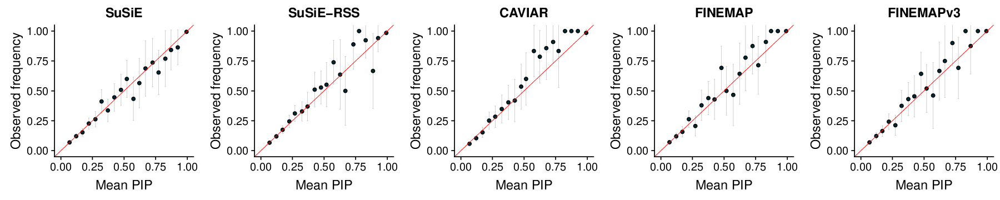

#### PIP comparison

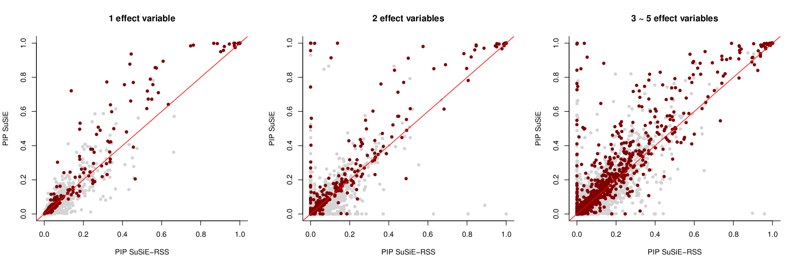
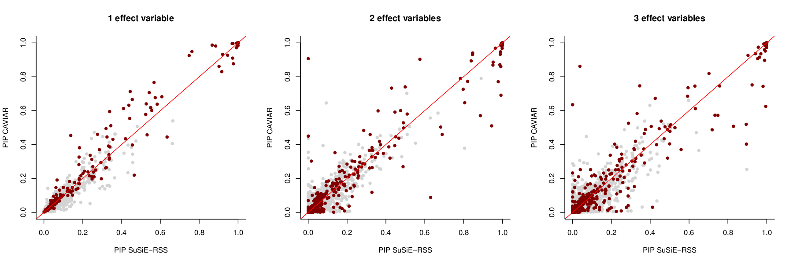


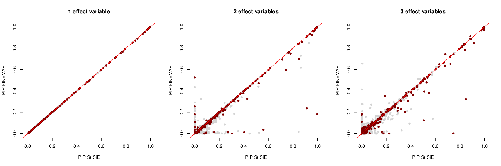


#### Power

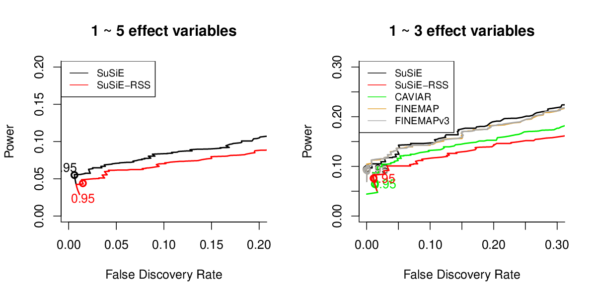

#### ROC


#### CS

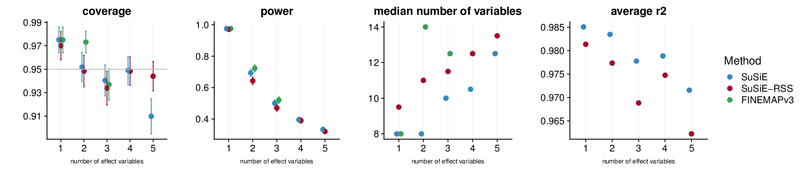

```{r fig.align='center', fig.width=20, results='asis'}
output = 'results/dsc.finemap.rss.ukb.default.2.8/susie_rss_ukb_default_cs_compare/susie_rss_ukb_default_pip_initoracle_AZFALSE_ldin_sample_ERFALSE_lamb0.1_cs.rds'
result = readRDS(output)
print(kableExtra::kable_styling(knitr::kable(round(result[,c(1,17:20)],4))))
```

### Estimate residual variance

#### PIP calibration


#### PIP comparison


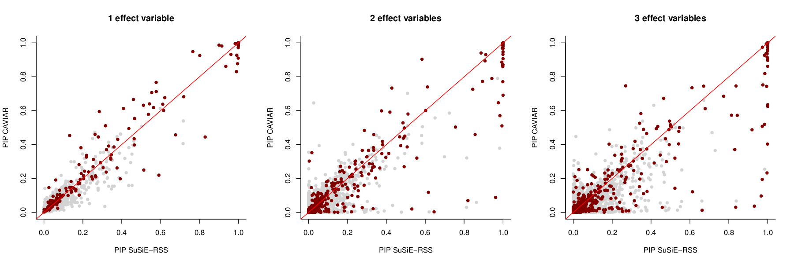


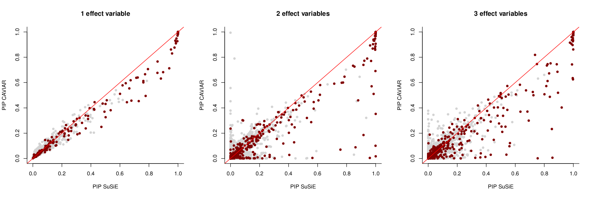


#### Power


#### ROC

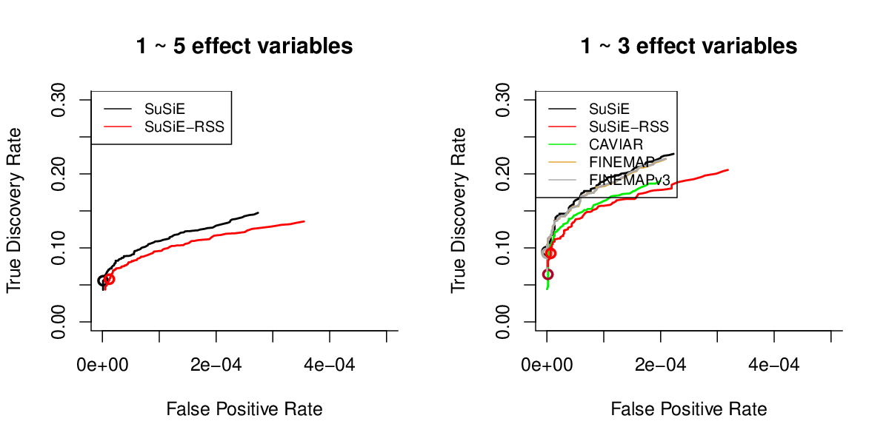

#### CS

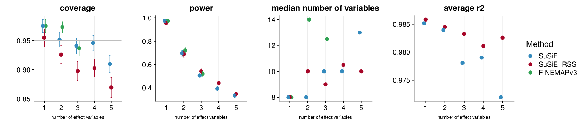

```{r fig.align='center', fig.width=20, results='asis'}
output = 'results/dsc.finemap.rss.ukb.default.2.8/susie_rss_ukb_default_cs_compare/susie_rss_ukb_default_pip_initoracle_AZFALSE_ldin_sample_ERTRUE_lamb0.1_cs.rds'
result = readRDS(output)
print(kableExtra::kable_styling(knitr::kable(round(result[,c(1,17:20)],4))))
```

## OUT sample

### NOT Estimate residual variance

#### PIP calibration


#### PIP comparison

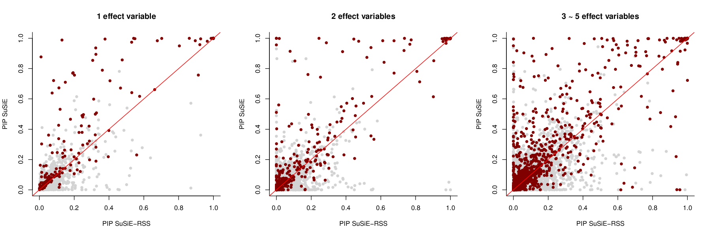


#### Power


#### ROC


#### CS


```{r fig.align='center', fig.width=20, results='asis'}
output = 'results/dsc.finemap.rss.ukb.default.2.8/susie_rss_ukb_default_cs_compare/susie_rss_ukb_default_pip_initoracle_AZFALSE_ldref_sample_ERFALSE_lamb0.1_cs.rds'
result = readRDS(output)
print(kableExtra::kable_styling(knitr::kable(round(result[,c(1,17:20)],4))))
```

### Estimate residual variance

#### PIP calibration

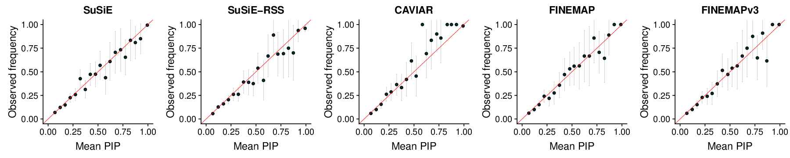

#### PIP comparison

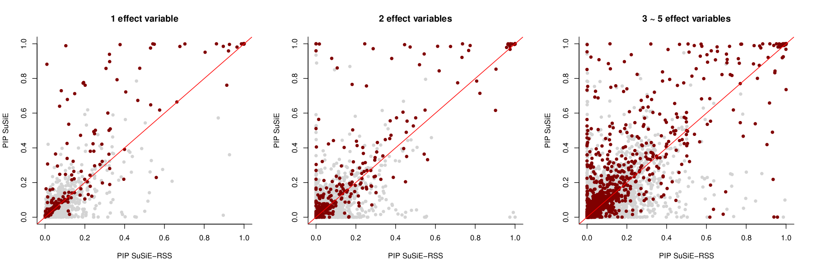


#### Power


#### ROC


#### CS

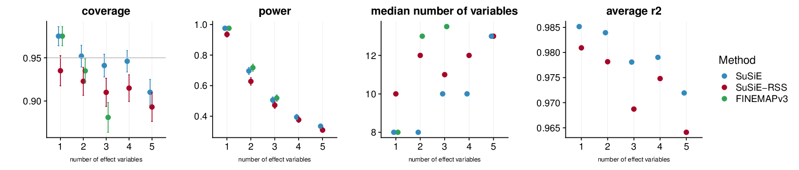

```{r fig.align='center', fig.width=20, results='asis'}
output = 'results/dsc.finemap.rss.ukb.default.2.8/susie_rss_ukb_default_cs_compare/susie_rss_ukb_default_pip_initoracle_AZFALSE_ldref_sample_ERTRUE_lamb0.1_cs.rds'
result = readRDS(output)
print(kableExtra::kable_styling(knitr::kable(round(result[,c(1,17:20)],4))))
```

## OUT sample ADDZ

### NOT Estimate residual variance

#### PIP calibration


#### PIP comparison

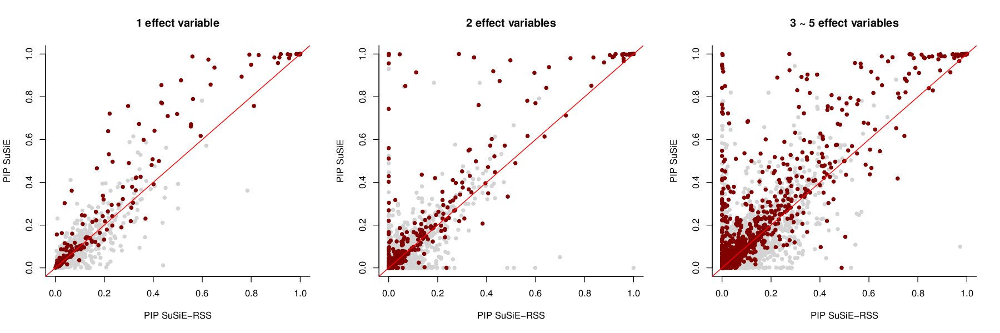


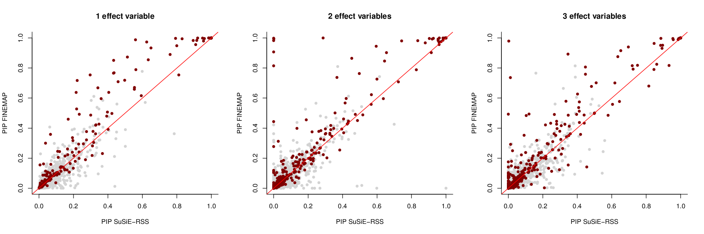

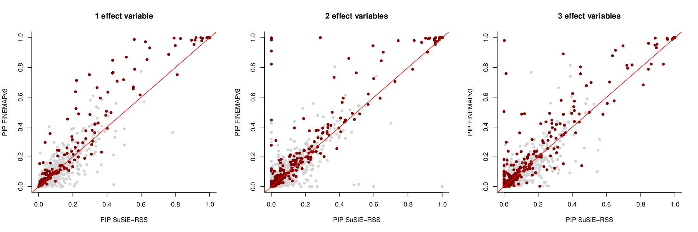

#### Power

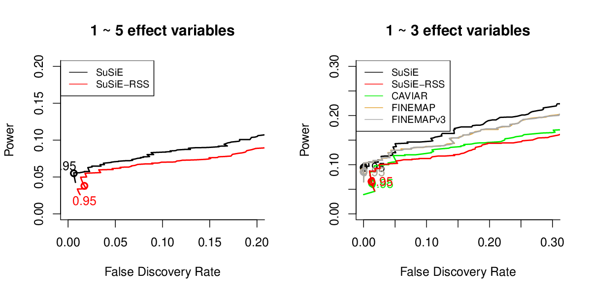

#### ROC


#### CS

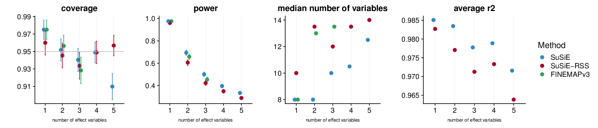

```{r fig.align='center', fig.width=20, results='asis'}
output = 'results/dsc.finemap.rss.ukb.default.2.8/susie_rss_ukb_default_cs_compare/susie_rss_ukb_default_pip_initoracle_AZTRUE_ldref_sample_ERFALSE_lamb0.1_cs.rds'
result = readRDS(output)
print(kableExtra::kable_styling(knitr::kable(round(result[,c(1,17:20)],4))))
```

### Estimate residual variance

#### PIP calibration


#### PIP comparison

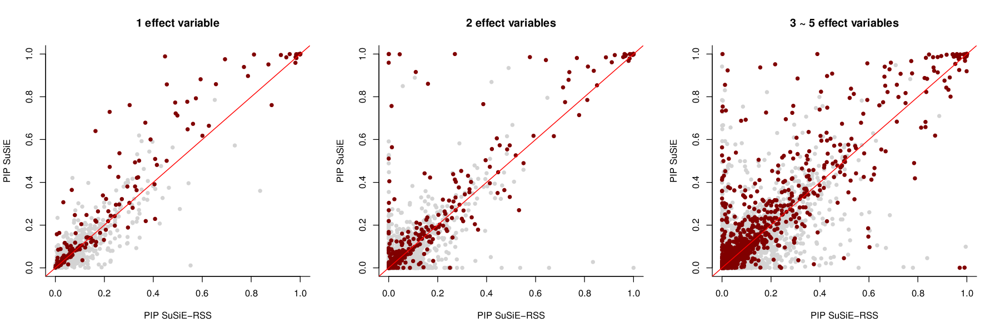


#### Power

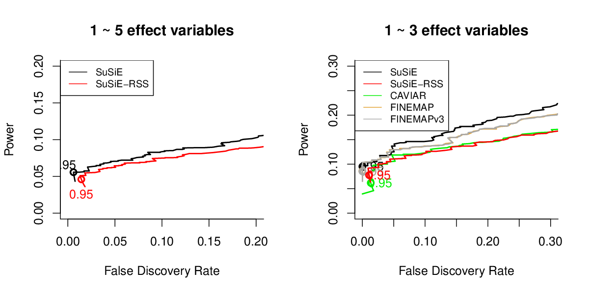

#### ROC

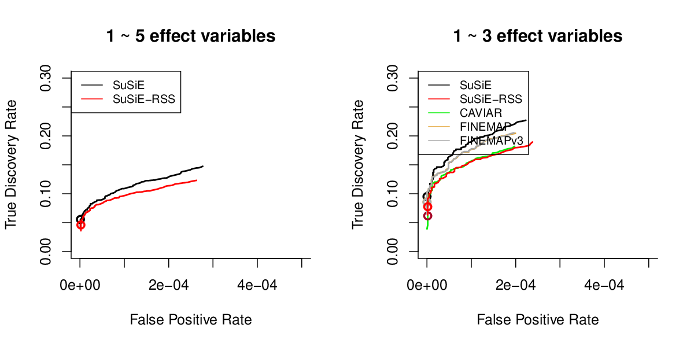

#### CS

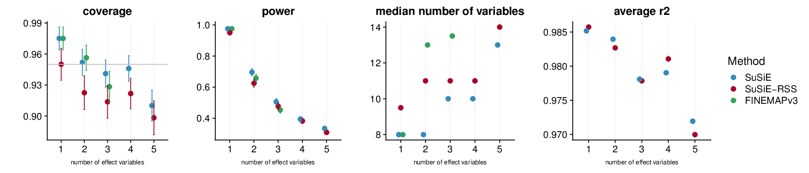

```{r fig.align='center', fig.width=20, results='asis'}
output = 'results/dsc.finemap.rss.ukb.default.2.8/susie_rss_ukb_default_cs_compare/susie_rss_ukb_default_pip_initoracle_AZTRUE_ldref_sample_ERTRUE_lamb0.1_cs.rds'
result = readRDS(output)
print(kableExtra::kable_styling(knitr::kable(round(result[,c(1,17:20)],4))))
```